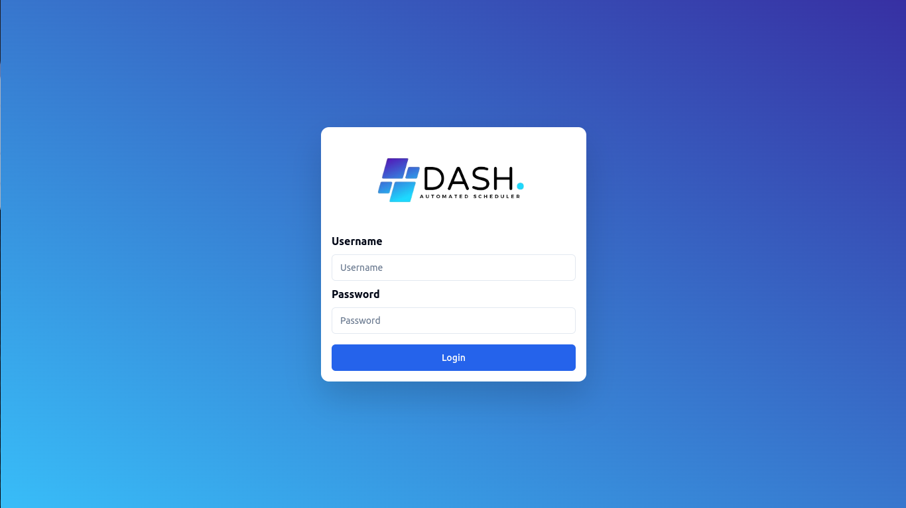
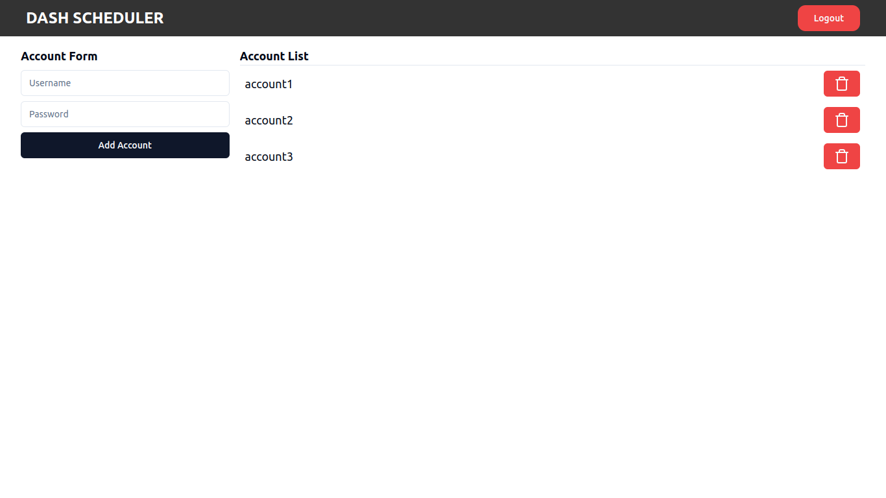
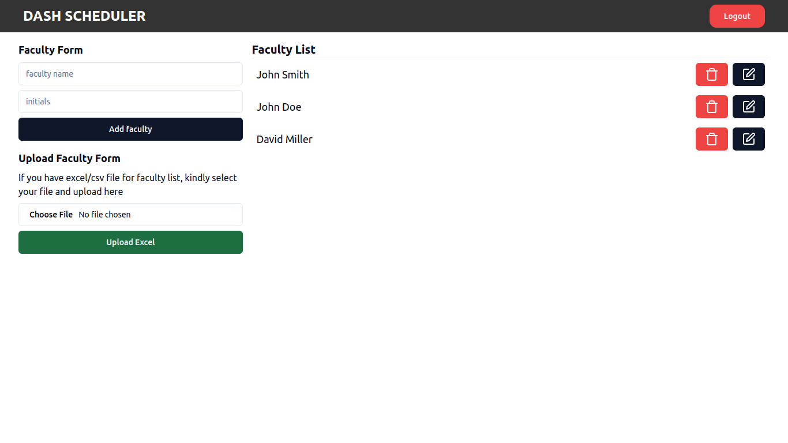
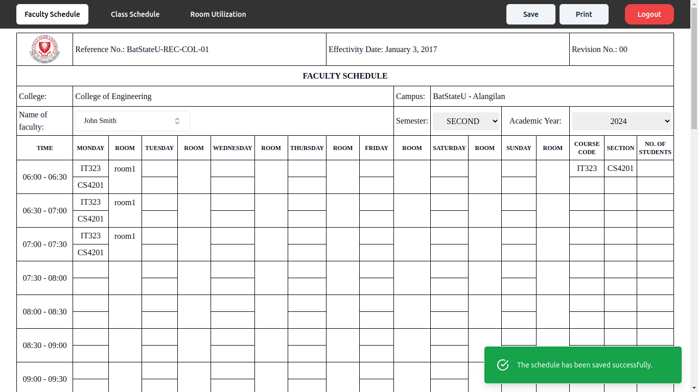
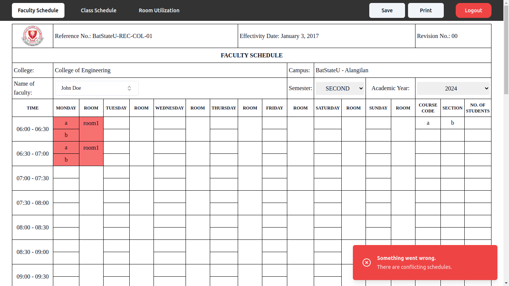

<h1 align="center"> Dash Scheduler </h1>

<div style="height:200px" align=center>
  
</div>

## :information_source: Description

A web based application for managing faculty and class section schedules.

## :camera_flash: Screenshots











## :hammer_and_wrench: Tech Stack

[](https://skillicons.dev)

## :star2: Features

### Authentication

- [x] Account login
- [x] Prevent page access when not authenticated.
- [ ] Password reset

### Admin

- [x] Add, Delete accounts
- [x] Add, Update, Delete Faculties

### Faculty Schedule

- [x] Select faculty and display schedule data.
- [x] Update schedule information.
- [x] Highlight conflicting schedules.
- [x] Automatic computation of teaching hours base on schedule.

### Room Utilization

- [x] Select room and display who uses it for a certain time.
- [ ] View by semester and academic year.

### Class Schedule

- [x] Display class schedule and their room occupancy.
- [ ] View by semester and academic year.

## :notebook_with_decorative_cover: Installation

<!-- Clone the [backend](https://github.com/hubymeme22/bsu-lazy-scheduling) of for this application. -->

Create a new folder to clone the frontend and backend of this application.

```bash
mkdir dash-scheduler
cd dash-scheduler
```

---

**Setting up frontend**

```bash
git clone git@github.com:Sanjero20/dash-scheduler.git

# rename folder to frontend
mv dash-scheduler frontend
cd frontend

# install dependencies
npm install
```

create a new <code>.env</code> file that contains this:

```bash
# change endpoint based on your server configuration
VITE_API_URL="http://localhost:8080"
```

---

**Setting up backend**

> Backend repository was created by [hubymeme22](https://github.com/hubymeme22/bsu-lazy-scheduling)

```bash
git clone git@github.com:hubymeme22/bsu-lazy-scheduling.git

# rename to backend
mv bsu-lazy-scheduling backend
cd backend

# install dependencies
npm install
```

> By default, the admin credentials is initialized in the .env file

```bash
IP="localhost"
PORT=8080

# Change according to your liking
ADMIN_USERNAME="admin"
ADMIN_PASSWORD="admin"
```

## :rocket: How to run application?

Start the server

```bash
cd dash-scheduler
cd server

npm start
```

Once the server is running, open a new terminal and run the following commands:

```bash
cd dash-scheduler
cd client

npm dev
```

> This will run the application at http://localhost:5173/
# FrontEnd_BSUScheduler
